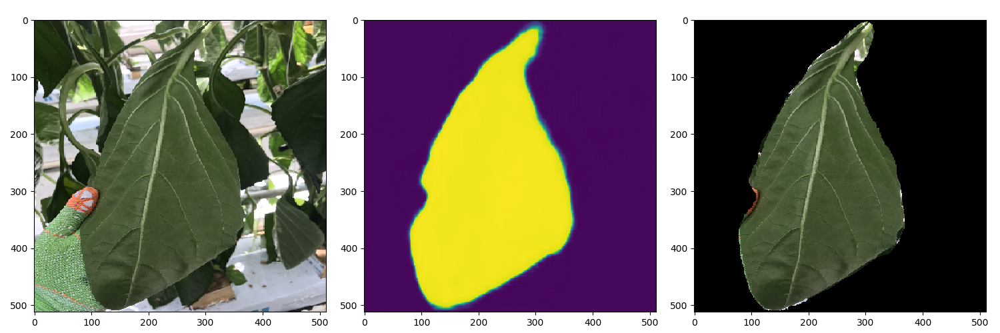

## paprika leaf segmentation

`semantic_seg_models_enet.py` - enet seg models for paprika leaves.
 
 - **_sample_data_** is sample leaf images for segmentation.  
 
 - **_sample_result_** is segmentation result of sample leaf images.
 
<h4>this result is just train set result. not test set<h4>
  
 ***
 
 
 
 